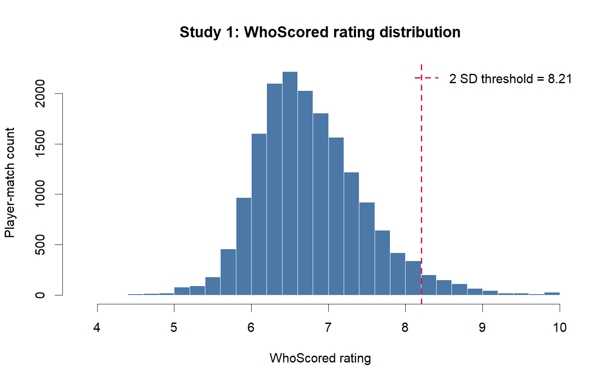
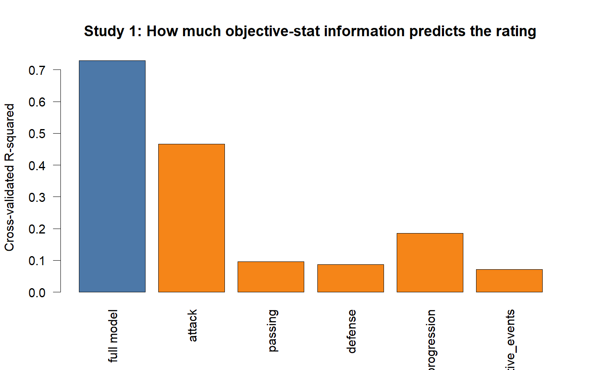
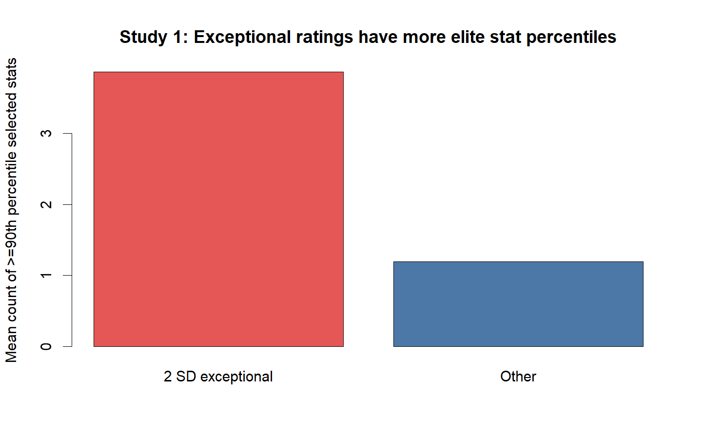
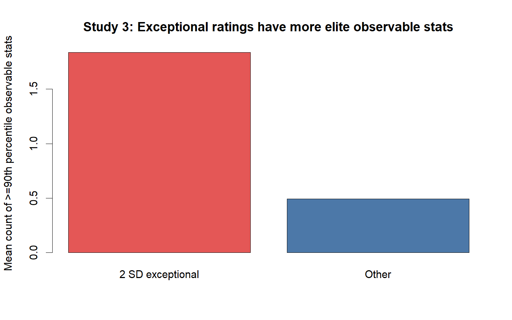

# Evaluating the Validity of WhoScored Ratings Using Study 1 and Study 3 Data

**Author:** Minh Huynh  
**Date:** 2026-04-14

## Executive summary

Using the Study 1 English league dataset and the pooled Study 3 tournament datasets, we evaluated whether the **WhoScored rating** behaves like a plausible match-performance measure and whether a **2 SD threshold** identifies genuinely exceptional performances. The evidence supports a **qualified positive conclusion**.

In Study 1, a cross-validated ridge model using transparent attacking, passing, defensive, progression, and negative-event variables explained **0.729** of the variance in the WhoScored rating.

In Study 1, performances above the overall 2 SD threshold averaged **0.997 goals**, **0.488 assists**, **1.545 shots on target**, and **3.863** selected stat dimensions at or above the 90th percentile within position. The corresponding non-exceptional values were **0.080**, **0.066**, **0.297**, and **1.194**.

In Study 3, within-tournament exceptional performances averaged **2.505 shots**, **1.309 shots on target**, **1.793 key passes**, and **1.836** observable stat dimensions at or above the 90th percentile. The corresponding non-exceptional values were **0.736**, **0.220**, **0.538**, and **0.494**.

A key caveat is that the overall 2 SD threshold is somewhat position-sensitive. In Study 1, the share above the overall threshold was **8.05%** for forwards, **5.47%** for midfielders, **2.60%** for goalkeepers, and **1.69%** for defenders. This is why a within-position or within-tournament-and-position robustness check is advisable.

## Key project outputs

| File | Purpose |
|---|---|
| `outputs/tables/study1_ws_rating_correlations.csv` | Variable-level validity evidence for the WhoScored rating |
| `outputs/tables/study1_group_model_r2.csv` | Cross-validated grouped-model predictive results |
| `outputs/tables/study1_exceptional_vs_others.csv` | Study 1 comparison of exceptional versus other performances |
| `outputs/tables/study3_exceptional_vs_others.csv` | Study 3 comparison of exceptional versus other performances |
| `outputs/tables/study3_tournament_threshold_summary.csv` | Tournament-specific threshold behavior |
| `outputs/figures/` | Figures for manuscript or appendix use |

## Reviewer-facing paragraph

> We agree that the use of a proprietary vendor rating requires empirical justification. To address this concern, we conducted an additional validation analysis using the Study 1 league dataset, which contains WhoScored ratings alongside a wide set of transparent match statistics. In that analysis, the WhoScored rating showed substantial associations with observable attacking, creative, defensive, and progression variables, and a cross-validated model using transparent match actions explained most of the variance in the WhoScored rating. We further examined the performances classified as exceptional under our 2 SD rule and found that these performances were markedly stronger than the remaining player-matches on transparent indicators such as goals, assists, shots on target, expected-goal and expected-assist measures, and key passes. We then replicated this logic in the Study 3 tournament data and found that player-matches exceeding the within-tournament 2 SD threshold also had substantially stronger observable profiles. These results do not imply that the proprietary algorithm is fully transparent, but they do provide criterion-related and face-validity evidence that the rating captures strong match performance and that the upper-tail classification identifies genuinely exceptional performances. We also note that overall thresholds can be position-sensitive, so we recommend a robustness analysis using thresholds standardized within competition and position.

## Figures

